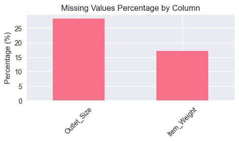
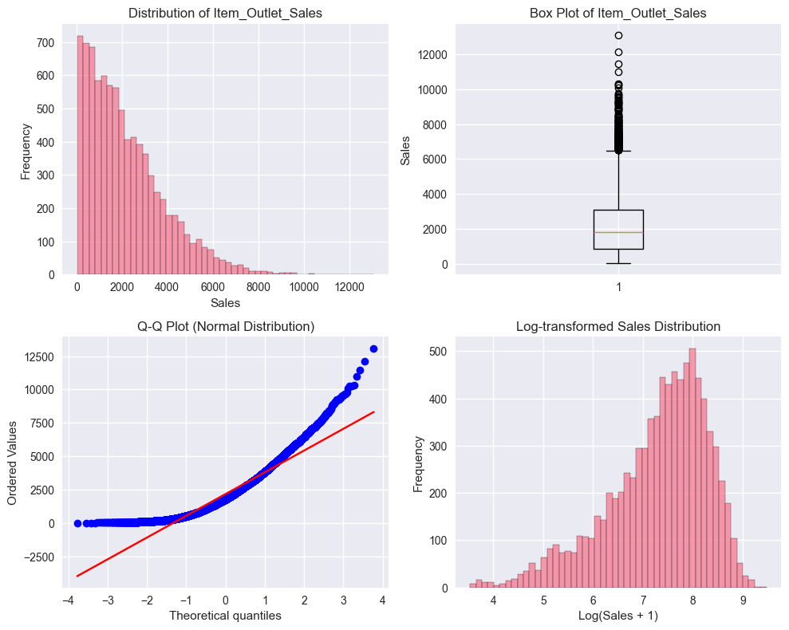
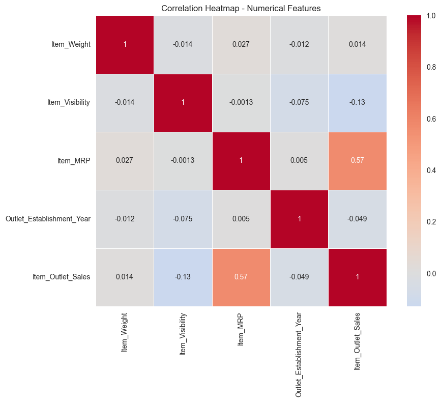
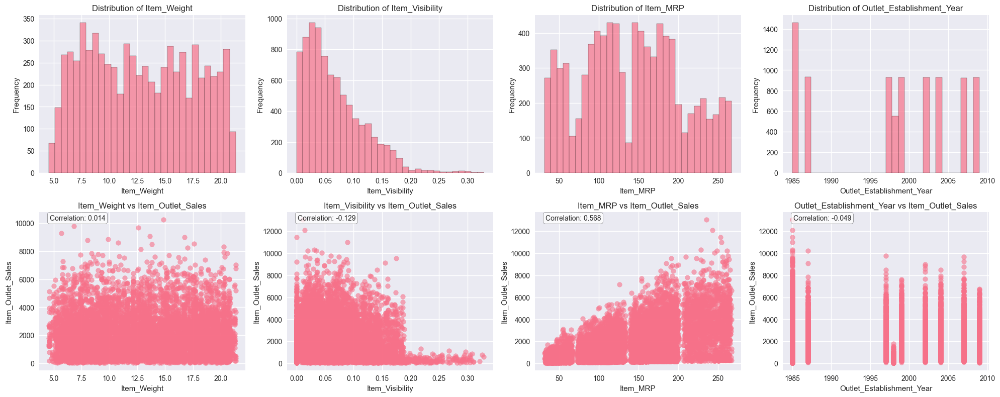
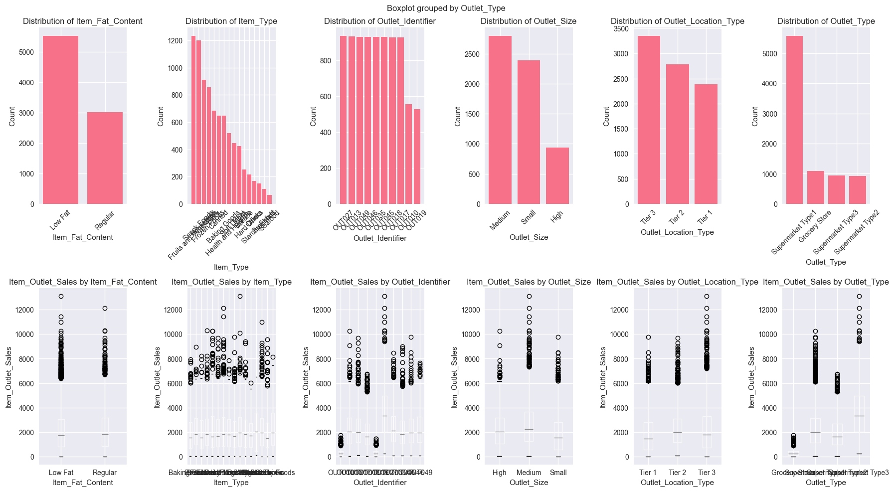
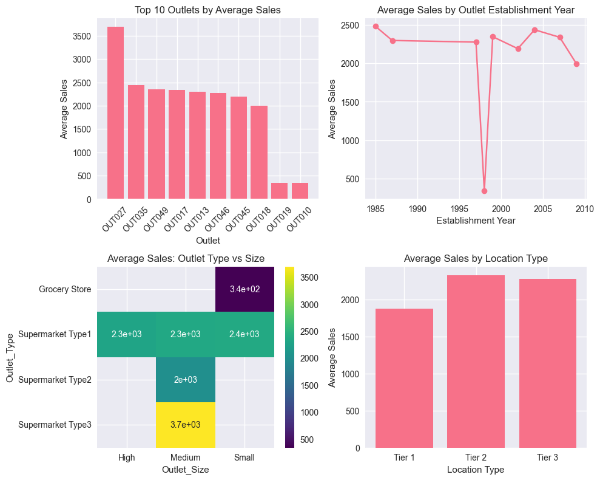
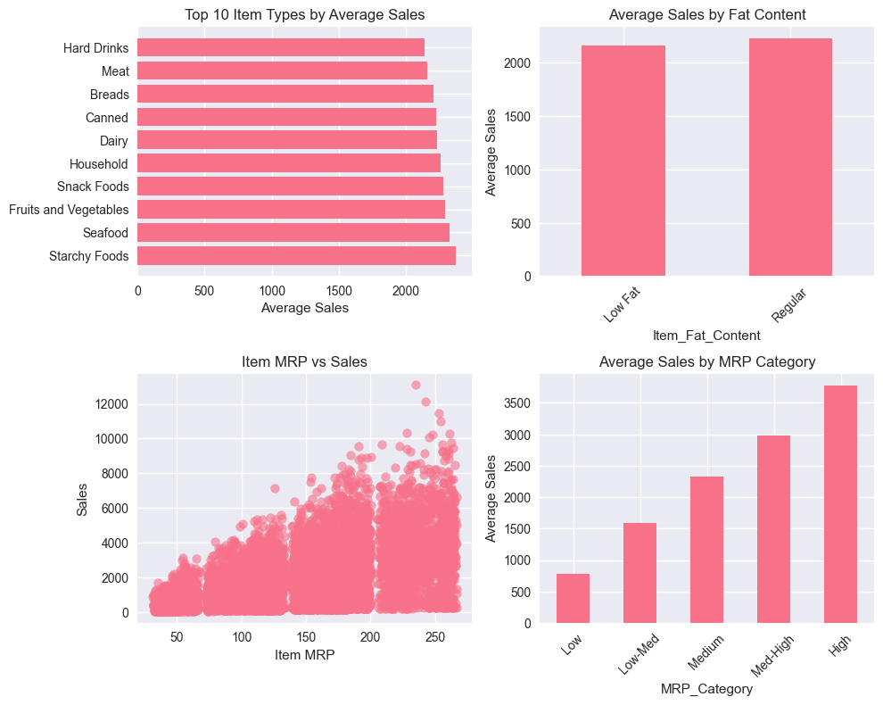
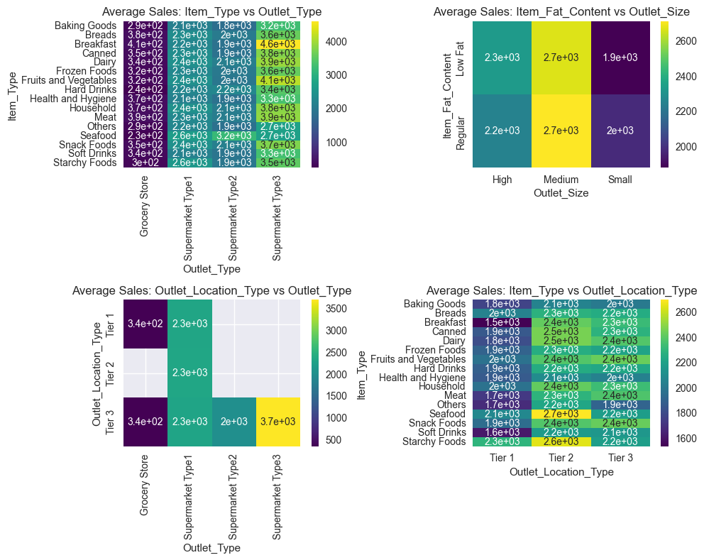

Starting Comprehensive EDA for Item_Outlet_Sales Estimation...

----

## DATASET OVERVIEW

----

Dataset Shape: (8523, 12)

Target Variable: Item_Outlet_Sales

Data Types:

|                           | 0       |
|:--------------------------|:--------|
| Item_Identifier           | object  |
| Item_Weight               | float64 |
| Item_Fat_Content          | object  |
| Item_Visibility           | float64 |
| Item_Type                 | object  |
| Item_MRP                  | float64 |
| Outlet_Identifier         | object  |
| Outlet_Establishment_Year | int64   |
| Outlet_Size               | object  |
| Outlet_Location_Type      | object  |
| Outlet_Type               | object  |
| Item_Outlet_Sales         | float64 |

Basic Statistics:

|       |   Item_Weight |   Item_Visibility |   Item_MRP |   Outlet_Establishment_Year |   Item_Outlet_Sales |
|:------|--------------:|------------------:|-----------:|----------------------------:|--------------------:|
| count |    7060       |      8523         |  8523      |                  8523       |            8523     |
| mean  |      12.8576  |         0.066132  |   140.993  |                  1997.83    |            2181.29  |
| std   |       4.64346 |         0.0515978 |    62.2751 |                     8.37176 |            1706.5   |
| min   |       4.555   |         0         |    31.29   |                  1985       |              33.29  |
| 25%   |       8.77375 |         0.0269895 |    93.8265 |                  1987       |             834.247 |
| 50%   |      12.6     |         0.0539309 |   143.013  |                  1999       |            1794.33  |
| 75%   |      16.85    |         0.0945853 |   185.644  |                  2004       |            3101.3   |
| max   |      21.35    |         0.328391  |   266.888  |                  2009       |           13087     |

----

## MISSING VALUES ANALYSIS

Missing Values Summary:

|             |   Missing_Count |   Missing_Percentage |
|:------------|----------------:|---------------------:|
| Outlet_Size |            2410 |              28.2764 |
| Item_Weight |            1463 |              17.1653 |

----

## TARGET VARIABLE ANALYSIS

Target Variable Statistics:

|       |   Item_Outlet_Sales |
|:------|--------------------:|
| count |            8523     |
| mean  |            2181.29  |
| std   |            1706.5   |
| min   |              33.29  |
| 25%   |             834.247 |
| 50%   |            1794.33  |
| 75%   |            3101.3   |
| max   |           13087     |

Outliers Analysis:

Number of outliers: 186 (2.18%)

Lower bound: -2566.33

Upper bound: 6501.87

Distribution Properties:

Skewness: 1.177

Kurtosis: 1.614

----

## NUMERICAL FEATURES ANALYSIS

Correlation Matrix:

|                           |   Item_Weight |   Item_Visibility |    Item_MRP |   Outlet_Establishment_Year |   Item_Outlet_Sales |
|:--------------------------|--------------:|------------------:|------------:|----------------------------:|--------------------:|
| Item_Weight               |     1         |       -0.0140477  |  0.0271412  |                 -0.0115883  |           0.0141227 |
| Item_Visibility           |    -0.0140477 |        1          | -0.00131485 |                 -0.0748335  |          -0.128625  |
| Item_MRP                  |     0.0271412 |       -0.00131485 |  1          |                  0.00501992 |           0.567574  |
| Outlet_Establishment_Year |    -0.0115883 |       -0.0748335  |  0.00501992 |                  1          |          -0.049135  |
| Item_Outlet_Sales         |     0.0141227 |       -0.128625   |  0.567574   |                 -0.049135   |           1         |

----

## CATEGORICAL FEATURES ANALYSIS

Item_Fat_Content Analysis:

Unique values: 2

Value counts:

| Item_Fat_Content   |   count |
|:-------------------|--------:|
| Low Fat            |    5517 |
| Regular            |    3006 |

Sales statistics by Item_Fat_Content:

| Item_Fat_Content   |    mean |   median |     std |   count |
|:-------------------|--------:|---------:|--------:|--------:|
| Low Fat            | 2157.71 |  1765.04 | 1697.97 |    5517 |
| Regular            | 2224.56 |  1844.6  | 1721.48 |    3006 |

Item_Type Analysis:

Unique values: 16

Value counts:

| Item_Type             |   count |
|:----------------------|--------:|
| Fruits and Vegetables |    1232 |
| Snack Foods           |    1200 |
| Household             |     910 |
| Frozen Foods          |     856 |
| Dairy                 |     682 |
| Canned                |     649 |
| Baking Goods          |     648 |
| Health and Hygiene    |     520 |
| Soft Drinks           |     445 |
| Meat                  |     425 |
| Breads                |     251 |
| Hard Drinks           |     214 |
| Others                |     169 |
| Starchy Foods         |     148 |
| Breakfast             |     110 |
| Seafood               |      64 |

Sales statistics by Item_Type:

| Item_Type             |    mean |   median |     std |   count |
|:----------------------|--------:|---------:|--------:|--------:|
| Baking Goods          | 1952.97 |  1577.95 | 1546.79 |     648 |
| Breads                | 2204.13 |  1860.25 | 1644.24 |     251 |
| Breakfast             | 2111.81 |  1554.64 | 1911.69 |     110 |
| Canned                | 2225.19 |  1860.25 | 1645.24 |     649 |
| Dairy                 | 2232.54 |  1650.85 | 1884.4  |     682 |
| Frozen Foods          | 2132.87 |  1687.14 | 1724.78 |     856 |
| Fruits and Vegetables | 2289.01 |  1830.95 | 1799.5  |    1232 |
| Hard Drinks           | 2139.22 |  1816.64 | 1606.19 |     214 |
| Health and Hygiene    | 2010    |  1669.49 | 1553.63 |     520 |
| Household             | 2258.78 |  1981.42 | 1692.25 |     910 |
| Meat                  | 2158.98 |  1829.62 | 1695.23 |     425 |
| Others                | 1926.14 |  1713.77 | 1431.86 |     169 |
| Seafood               | 2326.07 |  2055.32 | 1842.99 |      64 |
| Snack Foods           | 2277.32 |  1944.14 | 1705.12 |    1200 |
| Soft Drinks           | 2006.51 |  1518.02 | 1674.25 |     445 |
| Starchy Foods         | 2374.33 |  1968.1  | 1773.95 |     148 |

Outlet_Identifier Analysis:

Unique values: 10

Value counts:

| Outlet_Identifier   |   count |
|:--------------------|--------:|
| OUT027              |     935 |
| OUT013              |     932 |
| OUT049              |     930 |
| OUT046              |     930 |
| OUT035              |     930 |
| OUT045              |     929 |
| OUT018              |     928 |
| OUT017              |     926 |
| OUT010              |     555 |
| OUT019              |     528 |

Sales statistics by Outlet_Identifier:

| Outlet_Identifier   |     mean |   median |      std |   count |
|:--------------------|---------:|---------:|---------:|--------:|
| OUT010              |  339.352 |  250.341 |  271.015 |     555 |
| OUT013              | 2299     | 2050.66  | 1533.53  |     932 |
| OUT017              | 2340.68  | 2005.06  | 1550.78  |     926 |
| OUT018              | 1995.5   | 1655.18  | 1375.93  |     928 |
| OUT019              |  340.33  |  265.321 |  249.979 |     528 |
| OUT027              | 3694.04  | 3364.95  | 2127.76  |     935 |
| OUT035              | 2438.84  | 2109.25  | 1538.51  |     930 |
| OUT045              | 2192.38  | 1834.94  | 1462.4   |     929 |
| OUT046              | 2277.84  | 1945.8   | 1488.41  |     930 |
| OUT049              | 2348.35  | 1966.11  | 1513.29  |     930 |

Outlet_Size Analysis:

Unique values: 3

Value counts:

| Outlet_Size   |   count |
|:--------------|--------:|
| Medium        |    2793 |
| Small         |    2388 |
| High          |     932 |

Sales statistics by Outlet_Size:

| Outlet_Size   |    mean |   median |     std |   count |
|:--------------|--------:|---------:|--------:|--------:|
| High          | 2299    |  2050.66 | 1533.53 |     932 |
| Medium        | 2681.6  |  2251.07 | 1855.21 |    2793 |
| Small         | 1912.15 |  1544.66 | 1582.37 |    2388 |

Outlet_Location_Type Analysis:

Unique values: 3

Value counts:

| Outlet_Location_Type   |   count |
|:-----------------------|--------:|
| Tier 3                 |    3350 |
| Tier 2                 |    2785 |
| Tier 1                 |    2388 |

Sales statistics by Outlet_Location_Type:

| Outlet_Location_Type   |    mean |   median |     std |   count |
|:-----------------------|--------:|---------:|--------:|--------:|
| Tier 1                 | 1876.91 |  1487.4  | 1561.65 |    2388 |
| Tier 2                 | 2323.99 |  2004.06 | 1520.54 |    2785 |
| Tier 3                 | 2279.63 |  1812.31 | 1912.45 |    3350 |

Outlet_Type Analysis:

Unique values: 4

Value counts:

| Outlet_Type       |   count |
|:------------------|--------:|
| Supermarket Type1 |    5577 |
| Grocery Store     |    1083 |
| Supermarket Type3 |     935 |
| Supermarket Type2 |     928 |

Sales statistics by Outlet_Type:

| Outlet_Type       |     mean |   median |      std |   count |
|:------------------|---------:|---------:|---------:|--------:|
| Grocery Store     |  339.829 |  256.999 |  260.852 |    1083 |
| Supermarket Type1 | 2316.18  | 1990.74  | 1515.97  |    5577 |
| Supermarket Type2 | 1995.5   | 1655.18  | 1375.93  |     928 |
| Supermarket Type3 | 3694.04  | 3364.95  | 2127.76  |     935 |

----

## OUTLET ANALYSIS

Top 10 Outlets by Average Sales:

| Outlet_Identifier   |    mean |   median |              sum |   count |     std |    cv |
|:--------------------|--------:|---------:|-----------------:|--------:|--------:|------:|
| OUT027              | 3694.04 |  3364.95 |      3.45393e+06 |     935 | 2127.76 | 0.576 |
| OUT035              | 2438.84 |  2109.25 |      2.26812e+06 |     930 | 1538.51 | 0.631 |
| OUT049              | 2348.35 |  1966.11 |      2.18397e+06 |     930 | 1513.29 | 0.644 |
| OUT017              | 2340.68 |  2005.06 |      2.16747e+06 |     926 | 1550.78 | 0.663 |
| OUT013              | 2299    |  2050.66 |      2.14266e+06 |     932 | 1533.53 | 0.667 |
| OUT046              | 2277.84 |  1945.8  |      2.1184e+06  |     930 | 1488.41 | 0.653 |
| OUT045              | 2192.38 |  1834.94 |      2.03673e+06 |     929 | 1462.4  | 0.667 |
| OUT018              | 1995.5  |  1655.18 |      1.85182e+06 |     928 | 1375.93 | 0.69  |
| OUT019              |  340.33 |   265.32 | 179694           |     528 |  249.98 | 0.735 |
| OUT010              |  339.35 |   250.34 | 188340           |     555 |  271.01 | 0.799 |

Sales by Outlet Establishment Year:

|   Outlet_Establishment_Year |    mean |   count |
|----------------------------:|--------:|--------:|
|                        1985 | 2483.68 |    1463 |
|                        1987 | 2299    |     932 |
|                        1997 | 2277.84 |     930 |
|                        1998 |  339.35 |     555 |
|                        1999 | 2348.35 |     930 |
|                        2002 | 2192.38 |     929 |
|                        2004 | 2438.84 |     930 |
|                        2007 | 2340.68 |     926 |
|                        2009 | 1995.5  |     928 |

----

## ITEM ANALYSIS

Sales by Item Type:

| Item_Type             |    mean |   median |   count |     std |
|:----------------------|--------:|---------:|--------:|--------:|
| Starchy Foods         | 2374.33 |  1968.1  |     148 | 1773.95 |
| Seafood               | 2326.07 |  2055.32 |      64 | 1842.99 |
| Fruits and Vegetables | 2289.01 |  1830.95 |    1232 | 1799.5  |
| Snack Foods           | 2277.32 |  1944.14 |    1200 | 1705.12 |
| Household             | 2258.78 |  1981.42 |     910 | 1692.25 |
| Dairy                 | 2232.54 |  1650.85 |     682 | 1884.4  |
| Canned                | 2225.19 |  1860.25 |     649 | 1645.24 |
| Breads                | 2204.13 |  1860.25 |     251 | 1644.24 |
| Meat                  | 2158.98 |  1829.62 |     425 | 1695.23 |
| Hard Drinks           | 2139.22 |  1816.64 |     214 | 1606.19 |
| Frozen Foods          | 2132.87 |  1687.14 |     856 | 1724.78 |
| Breakfast             | 2111.81 |  1554.64 |     110 | 1911.69 |
| Health and Hygiene    | 2010    |  1669.49 |     520 | 1553.63 |
| Soft Drinks           | 2006.51 |  1518.02 |     445 | 1674.25 |
| Baking Goods          | 1952.97 |  1577.95 |     648 | 1546.79 |
| Others                | 1926.14 |  1713.77 |     169 | 1431.86 |

Sales by Fat Content:

| Item_Fat_Content   |    mean |   median |   count |
|:-------------------|--------:|---------:|--------:|
| Low Fat            | 2157.71 |  1765.04 |    5517 |
| Regular            | 2224.56 |  1844.6  |    3006 |

Sales by MRP Category:

| MRP_Category   |    mean |   count |
|:---------------|--------:|--------:|
| Low            |  786.91 |    1496 |
| Low-Med        | 1593.63 |    2301 |
| Medium         | 2326.43 |    1902 |
| Med-High       | 2977.24 |    1680 |
| High           | 3776.52 |    1144 |

----

## FEATURE INTERACTIONS ANALYSIS

----

## STATISTICAL TESTS

ANOVA Test for Item_Identifier:

F-statistic: 3.3314

P-value: 0.0000

Result: Significant difference between groups

ANOVA Test for Item_Fat_Content:

F-statistic: 2.9867

P-value: 0.0840

Result: No significant difference between groups

ANOVA Test for Item_Type:

F-statistic: 2.7007

P-value: 0.0004

Result: Significant difference between groups

ANOVA Test for Outlet_Identifier:

F-statistic: 300.0791

P-value: 0.0000

Result: Significant difference between groups

ANOVA Test for Outlet_Size:

F-statistic: 131.0967

P-value: 0.0000

Result: Significant difference between groups

ANOVA Test for Outlet_Location_Type:

F-statistic: 53.9477

P-value: 0.0000

Result: Significant difference between groups

ANOVA Test for Outlet_Type:

F-statistic: 894.6500

P-value: 0.0000

Result: Significant difference between groups

----

## DATA QUALITY CHECKS

Number of duplicate rows: 0

Number of negative sales: 0

Number of zero sales: 0

Fat content variations: ['Low Fat' 'Regular']

Outlet identifier patterns: Outlet_Identifier
OUT    8523
Name: count, dtype: int64

----

## KEY INSIGHTS FOR MODELING

• Missing values detected in Item_Weight and Outlet_Size - consider imputation strategies

• Target variable is highly skewed - consider log transformation

• Item_MRP shows highest correlation with target (0.568)

• High cardinality features: ['Item_Identifier'] - consider target encoding

• High variation in outlet performance - outlet features are important

----

EDA COMPLETE!

----

